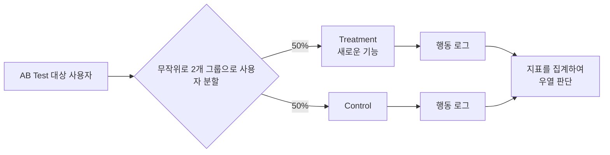

# 온라인 평가

- 대표적인 방법 A/B 테스트
- A/B 테스트는 무작위 비교 시험 (Randomized Controlled Trial, RCT) 이라 불리는 방법 중 하나 

### 가설 템플릿
| 항목        | 예                                         |
|-------------|--------------------------------------------|
| **콘텍스트** | 유행하는 숙소를 쉽게 찾지 못하는 사용자가 있다. |
| **변경점**   | 새로운 추천 알고리즘을 도입한다.               |
| **대상**     | 유럽 지역에서 독일어를 쓰는 사용자              |
| **지표 목표** | 숙박 예약률을 1% 향상시킨다.                  |
| **비즈니스 목표** | 숙박 예약을 통한 매출을 향상시킨다.           |

- 콘텍스트: 실험 배경은 무엇인가?
- 변경점: 무엇을 어떻게 바꾸는가?
- 대상: 대상 사용자는 누구인가?
- 지표 영향: 변경점이 지표에 어떤 영향을 미치는가?
- 비즈니스 목표: 이니셔티브를 통해 달성하고 싶은 최종 비즈니스 목표는 무엇인가?

### 주의점
- A/B 테스트는 사용자의 그룹을 나누어 평가하는 방법
- 테스트 전부터 그룹에 차이가 있다면 데트스가 올바르게 수행되지 않을 우려가 있음.
- 예 (그룹편향): 한쪽 사용자 그룹이 평소에도 극단적으로 클릭을 많이하는 사용자로만 구성되면 클릭 수 측정은 A/B 테스트로 올바르게 수행할 수 없음

- 로그 혼합에도 주의해야 함
- 이상적으로는 학습 모델 A가 사용자 그룹 A의 행동로그, 학습 모델 B가 사용자 그룹 B의 행동 로그에 의해서만 학습해야함.
- 학습 데이터 부족 등의 원인으로 뒤섞인 행동 로그에 따라 학습해야할 때도 있음.
- 이 경우 A/B 테스트에서 모델 A가 B에 이겼다고 해도 모델 A를 모든 사용자에게 적용할 때에 비해 B를 적용하는 편이 실제로 효과가 좋을 때도 있음.
- 예를 들어 모델 A는 모델 B에 의해 발생한 행동 로그가 없는 경우에 발생.

- 집계기간에도 주의
- 사용자는 새로운 변화에 과도하게 반응하는 경우가 있음
- 이런 경우 단기간 테스트 했을 때와 장기간 테스트 했을 때 결과가 달라지기도 함.

### 지표
- OEC (Overall Evaluation Criteria) 지표
    - OEC 지표는 장기적인 서비스 KPI와 연관되어야 함.
    - 단기간에는 팀이 행동할 때 충분히 공감해야 함.
    - 팀 단위 뿐 아니라 조직 전체가 OEC 지표에 대한 합의가 이루어져야 함.
    - OEC 지표는 사용자에게 초점을 맞춰 설계
        - 구글의 철학  
         " Focus on the user and all else wiil follow "
    - 사용자가 서비스나 상품을 통해 무엇을 달성하고 싶고 무엇을 경험하고 싶은가에 초럼을 맞춘 OEC 지표를 개선하는 것이 바람직함

사용자 만족도를 측정하는 지표를 설계하는 관점으로 다음을 생각할 수 있음.

- **Happiness**: 
    - 서비스에 대한 사용자의 감각 
    - 만족도, 시각적 매력, 쉬운 사용성 등 사용자의 주관적인 측면과 관계 있음.
    - 또한 행동 로그로 추정하기 어려운 경우 사용자 설문을 추가해 실시할 수도 있음
- **Engagement**: 
    - 상품에 대한 사용자의 관여 수준
    - 예를 들어 어떤 기간 동안의 서비스 실행 빈도나 인터랙션의 깊이 등이 됩니다.

- **Adoption**: 
    - 어떤 기간에 새로 상품을 사용하기 시작한 신규 사용자
- **Retention**: 
    - 어떤 기간의 사용자 중 몇 명이 그 뒤의 기간까지 여전히 서비스를 사용하고 있는가와 관련됨.
- **Task success**: 
    - 효율성(태스크 종료까지의 기간 등), 유효성(태스크 완료율 등), 예러율 등 기존 사용자 만족도와 관련됨.

- 가드레일 지표
    - OEC 지표는 개선하고자 하는 지표
    - 가드레일 지표는 저하되어서는 안되는 제약을 표시
    - 페이지 열람 수, 서비스 기동률, 응답 속도, 주간 액티브 사용자 수, 수익금 등이 있음.

### 지표 설계 방침

- **감도(Sensitivity)**:
  - 지표는 변화에 민감해야 한다.
  - 좋은 지표는 크게 변화활 확률이 적고 안정적으로 측정할 수 있다.
  - 민감도는 이동 확률과 통계력을 통해 측정할 수 있다.
  - A/B 테스트는 최소 80%의 검출력을 확보해야 한다.

- **신뢰성(Trustworthiness)**:
  - 지표는 신뢰성이 높아야 한다.
  - 외부 요인이나 에러가 결과에 영향을 미치지 않도록 주의해야 한다.
  - 예상치 못한 결과는 외적 원인 확인 및 신뢰성 재검토가 필요하다.

- **효율성(Efficiency)**:
  - 효율성 있는 지표는 시간, 복잡성, 비용의 균형을 고려해야 한다.
  - 성숙한 조직에서는 평가의 효율성도 점차 중요해진다.
  - 빠른 결과를 얻는 동시에 충분한 정확도를 유지하는 것이 중요하다.

- **디버깅 가능성(Debuggability)과 액션 가능성(Actionability)**:
  - 지표는 버그나 크래시를 감지할 수 있는 구조로 설계해야 하며, 문제 발생 시 수정할 수 있어야 한다.
  - 이상 발생 시 그 원인을 추적하고, 해결할 수 있는 구조를 갖추는 것이 중요하다.

- **해석 가능성(Interpretability)과 방향성(Directionality)**:
  - 지표는 쉽게 해석 가능해야 한다.
  - 비즈니스 목표와 방향성을 맞춰야 한다.
  - 지표의 변화가 목표 달성과 직결되는지 확인해야 한다.
